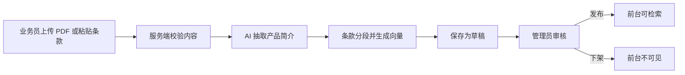
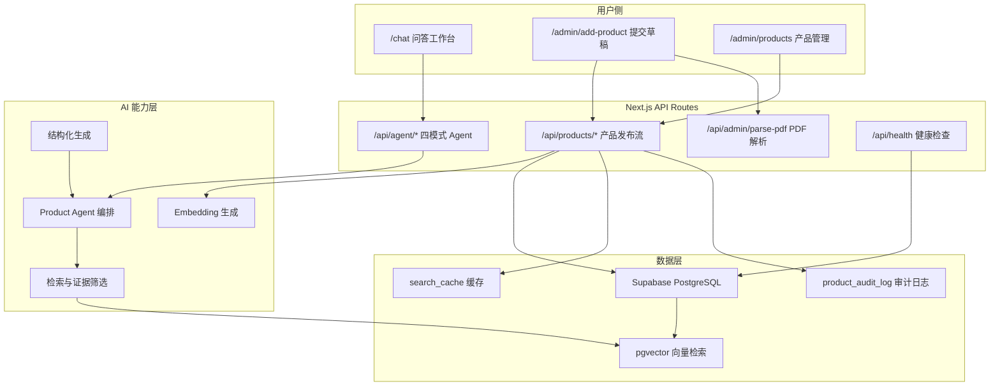
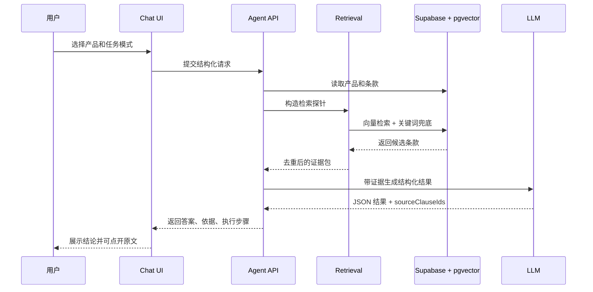

# 智析保险知识引擎

> 面向保险业务员和普通用户的 RAG 产品工作台。它不是简单把保险条款丢给大模型，而是把“产品上架、条款入库、证据检索、结构化回答、依据追溯、质量评估、Docker 部署”做成一条完整闭环。

[](https://nextjs.org/)
[](https://react.dev/)
[](https://supabase.com/)
[](https://platform.openai.com/docs)
[](https://www.docker.com/)

在线演示：[https://insurance.heyqi.xyz](https://insurance.heyqi.xyz)

## 一句话介绍

保险条款长、术语多、责任边界复杂，普通用户很难判断“到底赔不赔、适不适合我”。本项目用 RAG 把原始条款转成可追溯的问答体验：用户选择产品和问题，系统给出结构化结论，并把每个关键结论链接回原文条款。

后台同时提供业务员产品发布流：上传 PDF 或粘贴条款，生成向量，保存为草稿，审核后发布。前台只展示已发布产品。

## 为什么这个项目有面试竞争力

很多 AI Demo 停在“能回答”。这个项目更接近真实产品：

| 能力 | 普通 Demo | 本项目 |
|---|---|---|
| 数据接入 | 手写 seed 数据 | 后台上传 PDF / 粘贴条款，草稿发布流 |
| 用户交互 | 单个自由输入框 | 产品选择、4 种任务模式、追问上下文 |
| RAG 可信度 | 答案无依据 | 每个结论绑定条款 ID，可打开原文证据 |
| 检索策略 | 单次向量召回 | 产品约束、语义检索、关键词兜底、证据去重 |
| 工程健壮性 | 出错靠刷新 | 超时、取消、重试、schema 校验、健康检查 |
| 可运营性 | 没有后台 | 产品管理、发布/下架、审计日志、缓存清理 |
| 可部署性 | 本地跑通 | Docker Compose、环境变量模板、健康检查 |
| 可讲述性 | 只有功能 | 有取舍、架构、风险、质量指标和迭代路线 |

## 核心场景

### 1. 用户问保险

用户不需要知道“向量检索、prompt、chunk”这些概念，只需要完成三步：

1. 选择一个已发布产品。
2. 选择任务模式：提问、解读、对比、风险审计。
3. 查看结构化结论，并点开右侧证据面板核对原文。

### 2. 业务员添加产品

业务员或管理员可以从后台提交新产品：

1. 上传 PDF 条款，或手动粘贴完整条款文本。
2. 系统抽取产品简介，进行条款分段，生成 embedding。
3. 产品先保存为草稿，不直接暴露给前台用户。
4. 管理员审核后点击发布，前台问答页才会出现该产品。

### 3. 面试官看工程能力

建议演示顺序：

1. 打开 `/chat`，展示 4 种 Agent 模式和证据追溯。
2. 打开 `/admin/add-product`，演示“提交草稿并生成向量”。
3. 打开 `/admin/products`，演示发布、下架、编辑和审计日志。
4. 打开 `/api/health`，展示依赖健康检查。
5. 讲清楚为什么用“产品选择 + 证据约束”降低 RAG 幻觉风险。

## 产品能力

### 前台问答工作台

| 模式 | 目标 | 输出 |
|---|---|---|
| 提问 | 回答用户围绕单产品的具体问题 | 短答案、依据、注意事项、追问建议 |
| 解读 | 把一个产品讲清楚 | 产品定位、核心保障、等待期、免责条款、适合人群 |
| 对比 | 比较两个保险产品 | 多维对比表、推荐倾向、风险提醒、下一步建议 |
| 审计 | 从风险角度检查产品 | 风险等级、关键发现、缺失信息、需人工确认项 |

前台交互做了几件对真实用户很重要的事：

- 产品下拉框支持搜索，并展示完整产品列表。
- 前台只展示 `is_active=true` 的已发布产品。
- 请求执行中可以取消，切换模式时会中止旧请求。
- 长任务有阶段进度，不让用户盯着空白页面等。
- 右侧证据面板固定在视窗内，滚动页面时也能随时核对条款。
- 结论里的条款编号可以点击，直接打开对应原文依据。

### 后台产品发布流

后台不是“开发者改脚本”，而是贴近业务人员的工作流：



相关文档：

- [产品发布流 API Contract](./docs/PRODUCT_WORKFLOW_API.md)
- [添加新险种指南](./docs/HOW_TO_ADD_PRODUCT.md)

## 系统架构



## RAG 设计

这个项目的核心判断是：保险问答不能让用户随意输入一个库外产品，然后期待模型自己猜。系统用“产品选择器”先把问题约束在已入库产品内，再对该产品条款做检索和回答。



### 关键策略

- 产品约束：前台只允许选择已发布产品，降低库外幻觉。
- 多探针检索：不同模式会拆成多个检索目标，例如保障、免责、等待期、适合人群。
- 关键词兜底：对保险专业词，如“免赔额、等待期、责任免除”，避免纯向量漏召回。
- 引用清洗：返回前会校验 `sourceClauseIds` 是否属于当前产品条款。
- 上下文压缩：控制传给 LLM 的条款长度，减少噪声和成本。
- 结构化输出：前端按字段渲染，避免一整段回答难以扫描。

## 技术栈

| 层 | 技术 |
|---|---|
| 前端 | Next.js 16, React 19, TypeScript, Tailwind CSS, lucide-react |
| API | Next.js API Routes, Zod schema 校验 |
| 数据库 | Supabase PostgreSQL, pgvector |
| AI | OpenAI-compatible API, embedding, structured generation |
| 文档解析 | PDF 上传解析接口 |
| 可观测 | 健康检查、审计日志、可选 LangFuse tracing |
| 部署 | Docker, Docker Compose |

说明：当前是面向 1-2 周交付的单仓 MVP 架构，API Routes 让前后端和部署复杂度都更低。如果团队要求 Python 服务化，可以把 `src/lib/agent` 和 `src/lib/rag` 抽到 FastAPI 服务中，Next.js 只保留 BFF 和页面。

## 快速开始

### 1. 安装依赖

```bash
git clone https://github.com/qd-maker/insurance-rag.git
cd insurance-rag
npm install
```

### 2. 配置环境变量

```bash
cp .env.example .env.local
```

最小必填项：

```env
NEXT_PUBLIC_SUPABASE_URL=https://your-project.supabase.co
NEXT_PUBLIC_SUPABASE_ANON_KEY=your-anon-key

SUPABASE_URL=https://your-project.supabase.co
SUPABASE_SERVICE_ROLE_KEY=your-service-role-key

OPENAI_API_KEY=sk-your-api-key
OPENAI_BASE_URL=https://your-openai-compatible-endpoint/v1

GENERATION_MODEL=gpt-4o-mini
EMBEDDING_MODEL=text-embedding-3-small
EMBEDDING_DIM=1536

ADMIN_TOKEN=replace-with-a-random-secret
ENABLE_SEARCH_CACHE=true
```

完整模板见 [.env.example](./.env.example)。

### 3. 初始化数据库

在 Supabase SQL Editor 中按顺序执行：

```text
supabase/sql/001_rag_schema.sql
supabase/sql/002_fix_trigger.sql
supabase/sql/004_migrate_embedding_1536.sql
supabase/sql/create_cache_table.sql
supabase/sql/migrate_audit_system.sql
```

如果你使用的 embedding 模型不是 1536 维，请同步调整：

- `EMBEDDING_DIM`
- 数据库向量字段维度
- `match_clauses` RPC 函数参数维度

### 4. 导入演示数据

```bash
npx tsx scripts/seed.ts
```

后续新增产品建议走后台：

```text
/admin/add-product -> 提交草稿
/admin/products -> 发布
```

### 5. 启动本地开发

```bash
npm run dev
```

访问：

- 前台问答：[http://localhost:3000/chat](http://localhost:3000/chat)
- 产品管理：[http://localhost:3000/admin/products](http://localhost:3000/admin/products)
- 提交产品：[http://localhost:3000/admin/add-product](http://localhost:3000/admin/add-product)
- 健康检查：[http://localhost:3000/api/health](http://localhost:3000/api/health)

## Docker 部署

```bash
cp .env.example .env.production

docker compose up -d --build
docker compose logs -f
```

验证：

```bash
curl http://localhost:3000/api/health
curl http://localhost:3000/api/products/list
```

更多部署细节见 [Docker 部署指南](./docs/DOCKER_DEPLOY.md)。

## API 概览

### Agent API

| 接口 | 用途 |
|---|---|
| `POST /api/agent/ask` | 单产品问答 |
| `POST /api/agent/explain` | 单产品解读 |
| `POST /api/agent/compare` | 双产品对比 |
| `POST /api/agent/audit` | 风险审计 |

### 产品管理 API

| 接口 | 用途 |
|---|---|
| `GET /api/products/list` | 产品列表 |
| `POST /api/products/add` | 提交产品草稿并生成向量 |
| `POST /api/products/toggle-status` | 发布或下架产品 |
| `POST /api/products/update` | 编辑产品并重新生成条款向量 |
| `POST /api/admin/parse-pdf` | 上传并解析 PDF |
| `GET /api/admin/audit-log` | 查看产品操作历史 |
| `GET /api/health` | 聚合健康检查 |

产品发布流详见 [PRODUCT_WORKFLOW_API.md](./docs/PRODUCT_WORKFLOW_API.md)。

## 项目结构

```text
src/
  app/
    chat/page.tsx                 # 主问答工作台
    admin/
      add-product/page.tsx        # 产品草稿提交
      products/page.tsx           # 产品管理、发布、下架、审计
    api/
      agent/                      # ask / explain / compare / audit
      products/                   # 产品新增、列表、更新、发布
      admin/                      # token、PDF、审计、缓存
      health/route.ts             # 健康检查
  lib/
    agent/product-agent.ts        # 4 模式 Agent 编排
    rag/                          # Advanced RAG pipeline
    schemas/                      # Zod 请求/响应校验
    embeddings.ts                 # embedding timeout / retry / dim check
    retrieval.ts                  # 检索工具

supabase/sql/                     # 表结构、RPC、缓存、审计迁移
scripts/                          # seed、评估、向量重建、日志分析
docs/                             # 部署、测试、产品发布流文档
```

## 质量与验证

常用检查：

```bash
npm run lint
npx tsc --noEmit --pretty false
npm run build
```

RAG 质量评估：

```bash
npm run baseline
npm run eval
npm run eval:compare
npm run eval:ragas
```

健康检查返回示例：

```json
{
  "status": "ok",
  "checks": {
    "environment": { "ok": true, "message": "所有必需的环境变量已配置" },
    "supabase": { "ok": true, "message": "Supabase 连接正常" },
    "openai": { "ok": true, "message": "OpenAI 连接正常 (维度: 1536)" },
    "database": { "ok": true, "message": "数据库表与 RPC 函数正常" },
    "rag_pipeline": { "ok": true, "message": "RAG 流水线正常 (1 条条款已嵌入)" },
    "cache": { "ok": true, "message": "缓存系统正常 (0 活跃, 0 过期)" }
  }
}
```

更多说明见 [测试与质量保证指南](./docs/TESTING.md)。

## 设计取舍

### 为什么不是完全自由输入

保险问答的风险不是“回答不够花哨”，而是“答错责任边界”。所以前台先让用户选择已入库产品，再围绕产品条款问答。这牺牲了一点自由度，但显著提升可控性、引用准确性和演示稳定性。

### 为什么新增产品默认草稿

保险条款属于高风险内容，后台新增后立即暴露给前台并不合理。草稿发布流可以让业务员提交，管理员审核，发布后再进入问答系统。这也是从 Demo 走向产品的关键一步。

### 为什么保留 seed 脚本

`scripts/seed.ts` 适合初始化演示数据和本地开发，但不适合作为线上业务入口。真实新增产品走后台发布流。

### 为什么当前采用单仓 Next.js

项目目标是短周期交付可演示 MVP。单仓减少跨服务调试和部署成本，适合面试项目快速展示完整闭环。后续如果要生产化，可以拆成：

- Next.js：页面和 BFF。
- FastAPI：RAG pipeline、PDF ingestion、异步任务。
- Redis / Queue：长任务和缓存。
- Object Storage：PDF 原件存储。

## 面试讲述模板

### 30 秒版本

这是一个保险条款 RAG 产品，不是普通 ChatBot。用户选择已发布保险产品后，可以提问、解读、对比和做风险审计。系统每个关键结论都绑定原文条款，后台支持业务员上传 PDF 或粘贴条款，生成向量后先保存草稿，管理员发布后前台才可检索。工程上有 schema 校验、超时取消、审计日志、缓存清理、健康检查和 Docker 部署。

### 2 分钟版本

我把保险问答拆成两个闭环。

第一个是用户闭环：前台用产品选择器限制问题范围，避免用户输入库外产品导致模型乱答。Agent 根据任务模式拆解检索目标，从 Supabase pgvector 中召回条款，再用 LLM 生成结构化 JSON。前端展示答案时，每个条款编号都可以点开原文依据。

第二个是运营闭环：业务员在后台上传 PDF 或粘贴条款，服务端做内容校验、简介抽取、条款分段和向量生成。产品默认是草稿，管理员审核发布后才会进入前台列表。这个设计让数据接入、审核、发布、问答和下架都能闭环，而不是只能靠开发者改脚本。

工程取舍上，我优先保证可控性和可演示性：用下拉选择降低幻觉风险，用 Zod 约束 API 输入输出，用健康检查诊断 Supabase、OpenAI、数据库 RPC、缓存等依赖，用 Docker Compose 简化部署。

### 可展开追问

- 如果问 RAG 幻觉：讲产品选择约束、条款 ID 校验、证据面板。
- 如果问性能：讲多阶段进度、AbortController、检索 topK、上下文压缩、缓存。
- 如果问工程：讲 API Contract、Zod schema、Docker、健康检查、审计日志。
- 如果问业务：讲草稿发布流、产品下架、业务员添加产品路径。
- 如果问后续优化：讲任务队列、PDF 原件存储、权限系统、FastAPI 服务拆分。

## 已知边界与后续路线

| 优先级 | 方向 | 价值 |
|---|---|---|
| P0 | 完善登录权限和角色区分 | 区分业务员、审核员、管理员 |
| P0 | 长任务异步化 | PDF 解析和 embedding 生成不阻塞请求 |
| P1 | PDF 原件对象存储 | 支持回看上传文件和版本追踪 |
| P1 | 产品版本管理 | 已发布版本和草稿修订并存 |
| P1 | 自动化 E2E 测试 | 固化演示路径，降低回归风险 |
| P2 | FastAPI 拆分 | 独立 AI 服务，便于扩展任务队列 |
| P2 | 质量报告可视化 | 把 eval 结果变成面试展示页 |

## 常用命令

| 命令 | 说明 |
|---|---|
| `npm run dev` | 启动开发服务器 |
| `npm run dev:turbo` | 使用 Turbopack 启动开发服务器 |
| `npm run build` | 生产构建 |
| `npm run start` | 启动生产服务 |
| `npm run lint` | ESLint 检查 |
| `npm run baseline` | 生成质量基线 |
| `npm run eval` | 运行质量评估 |
| `npm run eval:compare` | 多配置对比评估 |
| `npm run eval:ragas` | RAGAS 评估 |
| `npm run regenerate:vectors` | 重新生成条款向量 |
| `npm run analyze-logs` | 分析查询日志 |
| `npm run check-logs` | 检查日志体积 |
| `npm run test` | Vitest 测试 |
| `npm run test:e2e` | Playwright E2E 测试 |

## License

MIT，详见 [LICENSE](./LICENSE)。
